<div align="center">
  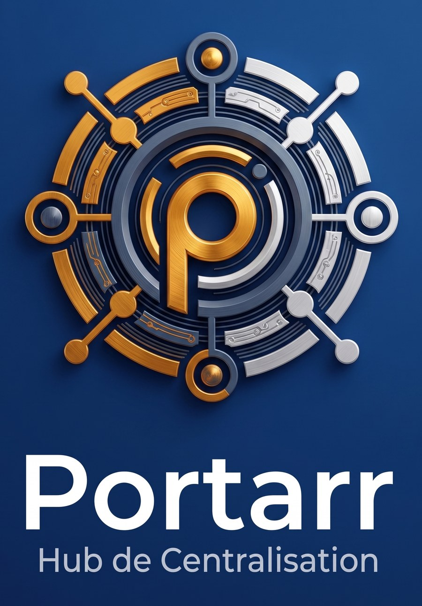

  <h3>A lightweight, modern portal for your Plex community — the friendly Organizr replacement.</h3>

  <p>
    <a href="#screenshots">Screenshots</a> ·
    <a href="#features">Features</a> ·
    <a href="#configuration">Configuration</a> ·
    <a href="#deploy-docker">Deploy</a>
  </p>
</div>

---

## Why Portarr

If you're running Plex for family or friends, you've probably reached for [Organizr](https://organizr.app) to give them one nice landing page instead of five bookmarks. Portarr is what that page can look like when it's built specifically for a Plex community instead of being a generic dashboard: it knows about your library, your requests, and your users — because it talks to Plex, Sonarr, Radarr, Overseerr and Tautulli directly, not through iframes.

What that gets you, concretely:

- **Real Plex login**, not a shared portal password — every user signs in with their own Plex account, and access follows whoever your server actually shares with.
- **Content that reacts to who's looking** — personal watch history, personal stats, only your own pending requests.
- **No iframes to fight with** — no X-Frame-Options headaches, no CSS fighting five different apps' themes. One consistent UI, server-rendered, fast.
- **An admin who doesn't need to touch the server** to post an announcement, send a broadcast email, or check who's actually using the thing.

It's not trying to be a full media-management suite — for that, keep using \*arr's own UIs. Portarr is the page your users see.

## Screenshots

<a id="screenshots"></a>

### Dashboard

Recently-added movies and shows in an animated poster carousel — each card links straight to its Plex Web detail page — plus what's currently playing on the server.

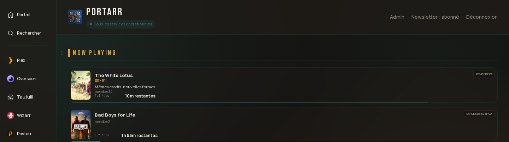
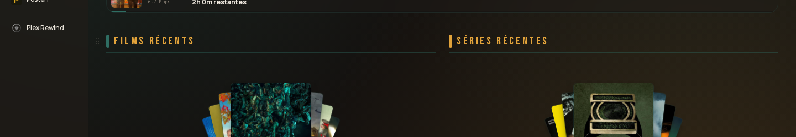


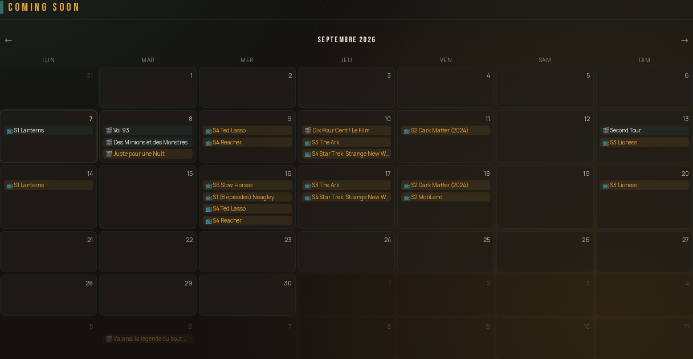

Server-wide stats from Tautulli, and each user's own pending Overseerr requests:

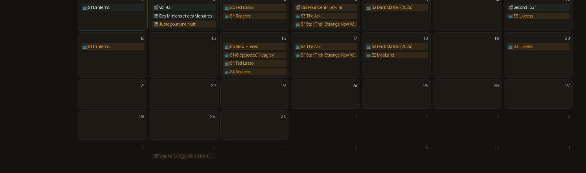
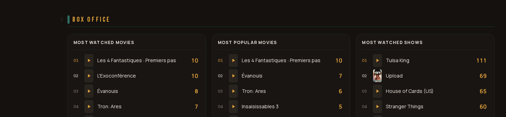
An upcoming-releases calendar sourced from Sonarr/Radarr:
### Global search

Search your Plex library from anywhere in the app; results link into Plex Web.

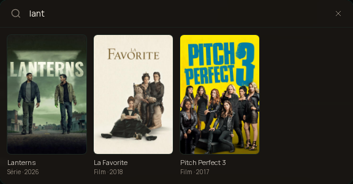

### File browser *(optional)*

Read-only browsing of a mounted directory, with signed-URL downloads (Range/resume supported). Only appears when `FILES_ROOT_PATH` is configured.

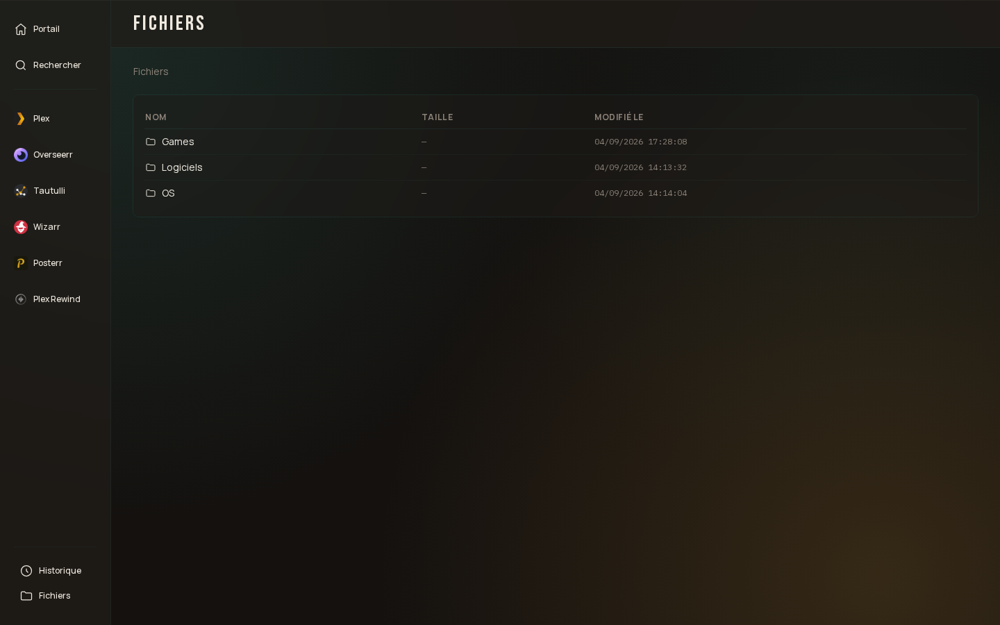

### Admin panel

Manage members, mailings, storage, and dashboard announcements without a redeploy.

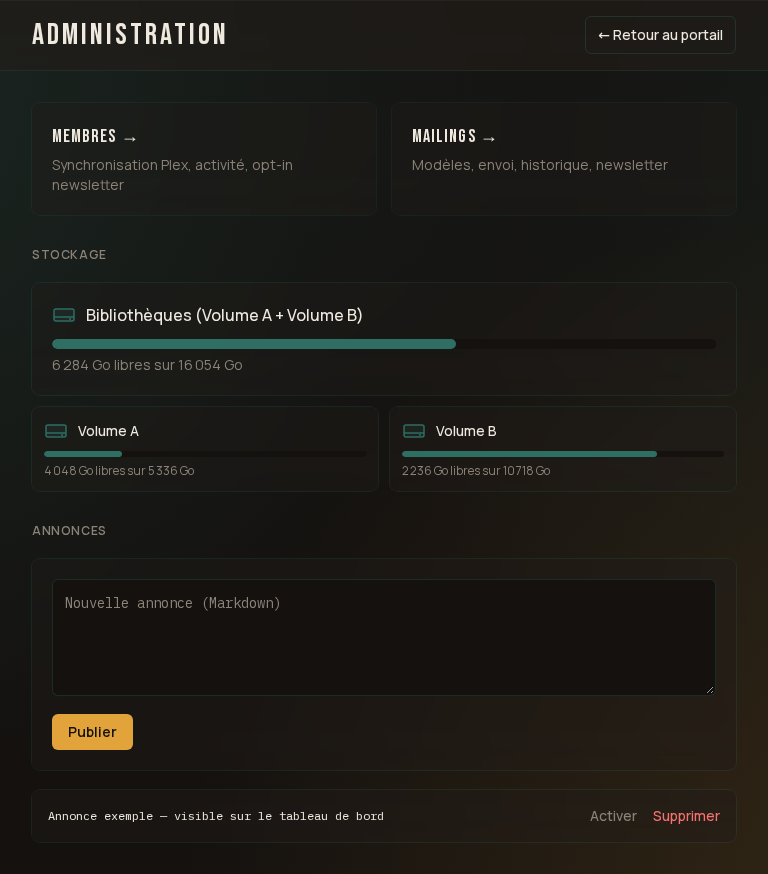

A members view cross-referenced with Plex/Tautulli activity and newsletter opt-in status:

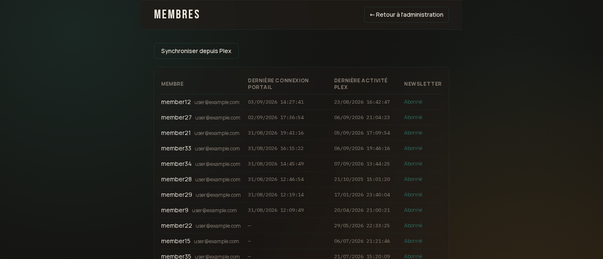

Reusable mail templates, a send history, and the automated newsletter, all in one place:

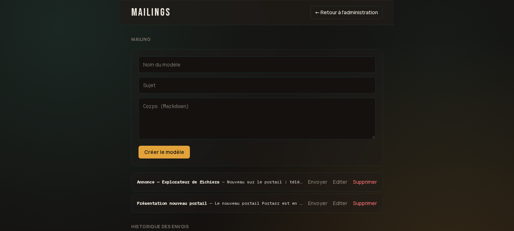

*(All screenshots above are from a real running instance, with usernames and emails replaced by placeholders.)*

## Features

<a id="features"></a>

- **Plex SSO login** — OAuth PIN flow, no separate account system. Access is restricted to accounts your Plex server actually shares with.
- **Dashboard** — recently-added carousel, release calendar, now-playing, pending requests, server-wide and personal Tautulli stats, personal watch history, optional storage widget. *(see [Screenshots](#screenshots))*
- **Global search** — searches your Plex library, links straight into Plex Web. *(see [Screenshots](#screenshots))*
- **File browser** *(optional)* — read-only directory browsing with signed, resumable downloads; serves files directly or redirects to a separate proxy service. *(see [Screenshots](#screenshots))*
- **Announcements** — an admin-managed banner on the dashboard, no redeploy needed.
- **Mailing** — broadcast to your user base (by activity group or hand-picked), reusable Markdown templates, a required test-send before any mass send. *(see [Screenshots](#screenshots))*
- **Newsletter** — automated "what's new" recap, opt-in/opt-out per user, a public web archive, cron-triggered or manual.
- **Availability notifications** — emails a user automatically when their approved Overseerr request becomes available.
- **Admin panel** — announcements, mail templates + history, members view, manual Plex sync, storage usage. *(see [Screenshots](#screenshots))*

## Stack

Next.js 14 (App Router, TypeScript) · SQLite (`better-sqlite3`) · Docker

## Requirements

- A Plex Media Server, with an API token for an account that can see your library and shared users.
- Sonarr and Radarr instances (used for the upcoming-releases calendar).
- Tautulli (used for now-playing and stats).
- Overseerr (used for request tracking).
- An SMTP account (used for mailing/newsletter/notifications).
- Node.js 20+ (for local dev) or Docker (for deployment).

## Configuration

<a id="configuration"></a>

Copy `.env.example` to `.env.local` (dev) or `.env` (Docker) and fill it in. Every variable below marked **required** must be set or the app refuses to start with a clear error listing exactly what's missing; everything marked **optional** can be left unset and the app runs fine — the feature it powers just doesn't appear.

| Variable | Required | Unlocks |
|---|---|---|
| `DATABASE_PATH` | ✅ | SQLite file location |
| `SESSION_SECRET` | ✅ | Session cookie signing (32+ random chars) |
| `PLEX_URL`, `PLEX_SERVER_TOKEN`, `PLEX_SERVER_NAME`, `PLEX_CLIENT_IDENTIFIER` | ✅ | Plex API access + login |
| `TAUTULLI_URL`, `TAUTULLI_API_KEY` | ✅ | Now-playing, stats |
| `SONARR_URL`, `SONARR_API_KEY` | ✅ | Release calendar (TV) |
| `RADARR_URL`, `RADARR_API_KEY` | ✅ | Release calendar (movies) |
| `OVERSEERR_URL`, `OVERSEERR_API_KEY` | ✅ | Pending requests, availability notifications |
| `SMTP_HOST`, `SMTP_PORT`, `SMTP_USER`, `SMTP_PASS`, `MAIL_FROM_ADDRESS`, `MAIL_FROM_NAME` | ✅ | Mailing, newsletter, availability notifications |
| `NEWSLETTER_CRON_SECRET` | ✅ | Auth for the newsletter/notification cron endpoints |
| `PUBLIC_BASE_URL` | ✅ | Absolute links in outgoing emails |
| `SHORTCUT_<NAME>_URL` / `SHORTCUT_<NAME>_ICON_URL` (×6: `PLEX`, `OVERSEERR`, `TAUTULLI`, `WIZARR`, `POSTERR`, `PLEX_REWIND`) | optional | A sidebar shortcut link, one per pair set. Both vars must be set for an icon to show; a shortcut with only `_URL` renders as a text-only link. Absent entirely = that shortcut just isn't in the sidebar. |
| `FILES_ROOT_PATH` | optional | The `/files` page, the sidebar "Files" link, and the download route |
| `FS_TIMEOUT_MS` | optional | Timeout (ms) for filesystem calls against the mount — defaults to `5000` |
| `DOWNLOAD_SIGNING_SECRET` | optional | Required only alongside `DOWNLOAD_PROXY_URL` — signs redirect URLs |
| `DOWNLOAD_PROXY_URL` | optional | Redirects downloads to a separate proxy instead of streaming through this app — see [Download proxy](#download-proxy-optional) |
| `STORAGE_VOLUMES` | optional | JSON array (`[{"name":"...","path":"..."}]`) of mounted volumes to show as usage bars on `/admin` |
| `KUMA_URL`, `KUMA_API_KEY` | optional | An "all up" / "N down" status badge on the dashboard, backed by [Uptime Kuma](https://github.com/louislam/uptime-kuma) |

Full reference with inline comments: [`.env.example`](.env.example).

## Run locally

```bash
cp .env.example .env.local   # fill in real values
npm install
npm run dev
```

## Tests & build

```bash
npm test         # vitest run
npm run typecheck  # tsc --noEmit
npm run build     # next build — catches classes of bug vitest/tsc miss (route handlers, Server/Client Component boundaries)
```

## Deploy (Docker)

<a id="deploy-docker"></a>

```bash
docker build -t portarr .
docker run -d \
  --name portarr \
  --env-file .env \
  -e HOSTNAME=0.0.0.0 \
  -v $(pwd)/data:/app/data \
  -p 3000:3000 \
  portarr
```

`HOSTNAME=0.0.0.0` is required — without it, the Next.js standalone server binds to the container's internal IP and its own internal API self-fetches (used by a couple of routes) break.

Put a reverse proxy (Traefik, Caddy, nginx...) in front for TLS; the app itself only speaks plain HTTP on port 3000.

### Mount a file browser directory (optional)

If you set `FILES_ROOT_PATH`, mount the directory it points to read-only into the container at that same path, e.g.:

```bash
-v /path/on/host:/mnt/shared-storage:ro
```

### Download proxy (optional)

By default, when `FILES_ROOT_PATH` is set and `DOWNLOAD_PROXY_URL` is not, the app serves file downloads itself (with HTTP Range support for resumable downloads). If your deployment puts the app behind a slow or tunneled network path to the storage mount, you can run [portarr-dl-proxy](https://github.com/titi69lpb/portarr-dl-proxy) on a machine with direct access to the storage and point `DOWNLOAD_PROXY_URL` at it — the app then signs a short-lived URL (HMAC-SHA256, `DOWNLOAD_SIGNING_SECRET` shared between both services) and redirects there instead of streaming the file itself.

### Cron jobs (optional)

Newsletter (adjust the schedule to taste):

```cron
0 14 * * 5 curl -s -X POST -H "x-newsletter-secret: $NEWSLETTER_CRON_SECRET" https://your-domain.example.com/api/admin/newsletter/send
```

Availability notifications (checks approved-but-not-yet-available Overseerr requests):

```cron
*/15 * * * * curl -s -X POST -H "x-cron-secret: $NEWSLETTER_CRON_SECRET" https://your-domain.example.com/api/cron/request-availability
```

Both reuse `NEWSLETTER_CRON_SECRET` rather than needing a dedicated secret.

## License

MIT — see [LICENSE](LICENSE).
